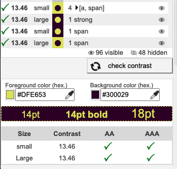

# Page d'accueil
***
## Quick scan

> Un site web réussit le test du Quickscan s'il obtient un score d'au moins 75%.


|     | Description                                                                                     | Pondération | Score     |
| --- | ----------------------------------------------------------------------------------------------- | ----------- | --------- |
| 1   | Les titres de pages sont-ils significatifs?                                                     | 1           | 0         |
| 2   | La langue des pages est-elle correctement indiquée?                                             | 2           | 1         |
| 3   | Le focus est-il visible lors de la tabulation?                                                  | 2           | 0         |
| 4   | Le site est-il entièrement utilisable au clavier ?                                              | 3           | 0         |
| 5   | Est-il possible d’arrêter les animations?                                                       | 2           | 0         |
| 6   | La différence entre les liens et le simple texte est-elle visuellement claire?                  | 1           | 0.5       |
| 7   | Les intitulés des liens sont-ils significatifs?                                                 | 2           | 1         |
| 8   | Toutes les images ont-elles une alternative textuelle?                                          | 2           | 1         |
| 9   | Les vidéos sont-elles sous-titrées?                                                             | 3           | 0         |
| 10  | Le contraste entre le texte et l’arrière-plan est-il suffisant?                                 | 3           | 0         |
| 11  | Les titres sont-ils codés au moyen des balises HTML adéquates?                                  | 2           | 0         |
| 12  | Les listes sont-elles codées au moyen des balises HTML adéquates?                               | 1           | 1         |
| 13  | Les champs de formulaire sont-ils reliés à leur label?                                          | 2           | 2         |
| 14  | Une aide textuelle est-elle présente lorsque la validation d’un formulaire détecte des erreurs? | 2           | 0         |
| 15  | Le code source est-il valide?                                                                   | 1           | 0.5       |
|     |                                                                                                 | Total : 29  | Total: 7  |

Le score est de **7**/29 :arrow_right: **24,137931**% :arrow_right:  **24**% de réussite

1. **Les titres de pages sont-ils significatifs?**

Le titre n'était pas très significatif pour la page d'accueil.


2. **La langue des pages est-elle correctement indiquée?**

Oui.

3. **Le focus est-il visible lors de la tabulation?**

Non.

4. **Le site est-il entièrement utilisable au clavier ?**

Non, plein d'éléments ne se cible pas.

5. **Est-il possible d’arrêter les animations?**

Non, les animations de font ne peuvent pas être arrêtées.

6. **La différence entre les liens et le simple texte est-elle visuellement claire?**

Ça dépends, certains sont très clair et d'autre non.

7. **Les intitulés des liens sont-ils significatifs?**

Encore une fois, ça dépends des liens.

8. **Toutes les images ont-elles une alternative textuelle?**

Certaines oui, d'autres non.


9. **Les vidéos sont-elles sous-titrées?**

Ici nous, avons de l'Audio qui n'a aucune alternative.

10. **Le contraste entre le texte et l’arrière-plan est-il suffisant?**

Non.

11. **Les titres sont-ils codés au moyen des balises HTML adéquates?**

Non.


12. **Les listes sont-elles codées au moyen des balises HTML adéquates?**

Oui.

13. **Les champs de formulaire sont-ils reliés à leur label?**

Non.

14. **Une aide textuelle est-elle présente lorsque la validation d’un formulaire détecte des erreurs?**

Oui même si elle pourrait être plus spécifique

15. **Le code source est-il valide?**

Oui en ignorant les erreurs et avertissements.

***

## HTML validator

- Manques des headings (``` <h1> <h2>``` etc)
- Plusieurs images sans Alternative textuelles ``` alt=""```
- fautes de sématiques  ```<button></button>``` dans un ```<a></a>```


***

## Outline


Pour l'analyse de l'outline j'ai utilisé [Headings Map](https://chrome.google.com/webstore/detail/headingsmap/flbjommegcjonpdmenkdiocclhjacmbi) qui est une extension sur Chrome qui liste les titres de la page.

Ce titrage doit être comme une table des matières des sites et dans ce cas-ci, on peut constater que l'outline est mauvais.


J'ai dont ajouter des titres afin de rendre l'outline correct et complète


***

## Rapport de contraste

Le contrast des éléments sur la page d'accueil était assez affolant.


Pour remédier à cette situation j'ai commencé par chercher des couleurs pour remplacer le jaune et le fushia sans sortir du thème.





***

## Microdata

La page d'accueil ne contient aucune microdata.
Le site utilise du JSON-LD pour la structuration des données du site et de l'ASBL.

Mais ce n'est pas complet.


Il faudrait rajouter, numéro de TVA de l'entreprise, email, et adresse physique


```Javascript
    <script type="application/ld+json">
            {
                "@context": "https://schema.org",
                "@type": "WebSite",
                "url": "https://www.abconcerts.be/",
                "name": "Ancienne Belgique ASBL"
            }
    </script>
```

```javascript
    <script type="application/ld+json">
        {
            "@context": "https://schema.org",
            "@type": "Organization",
            "url": "https://www.abconcerts.be/",
            "name": "Ancienne Belgique",
            "vatID": "BE0430973770",
            "address": {
              "@type": "PostalAddress",
              "streetAddress": "Boulevard Anspach 110",
              "postalCode": "1000",
              "addressLocality": "Bruxelles, Belgique"
            }
        }
    </script>

```

***

## Carbon Calculator


***

## GTMetrix

Le site charge plutôt rapidement, mais la rapidité peut être encore à améliorer. Comme déjà la taille des images sources qui sont affichées en petit alors qu'elles sont chargées en grand format.


***

## Responsive

s'adapte très bien mais :
- Dans le footer une section est complètement retirée et donc impossible d'accès
- Le bouton "tous les concerts" est placé à la fin de la section


## Site avant refonte


## Site après refonte


