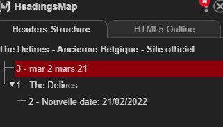
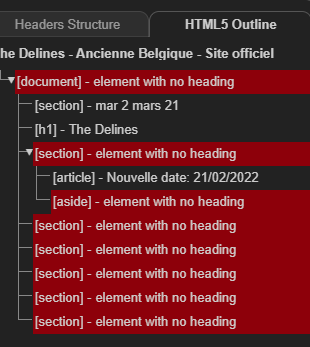
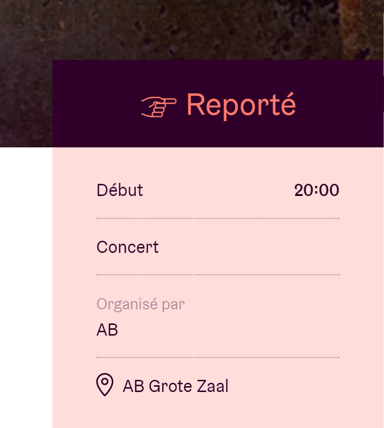
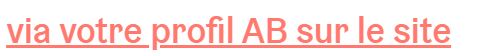
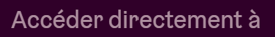
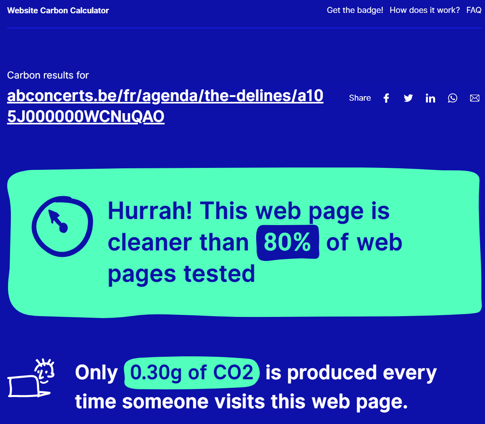
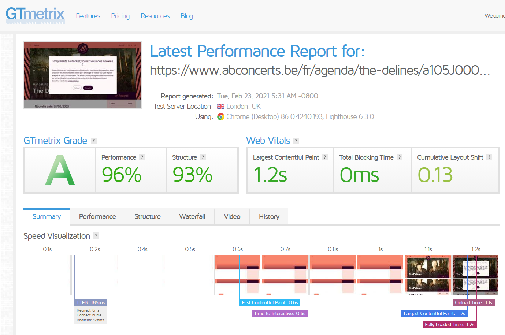
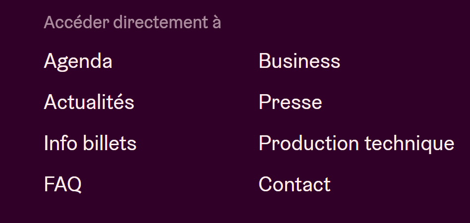

_Projet d'analyse du site https://www.abconcerts.be/_

_Page https://www.abconcerts.be/fr/agenda/the-delines/a105J000000WCNuQAO_

# Page concert

## Quick scan

|     | Description                                                                                     | Pondération | Score     |
| --- | ----------------------------------------------------------------------------------------------- | ----------- | --------- |
| 1   | Les titres de pages sont-ils significatifs?                                                     | 1           | /         |
| 2   | La langue des pages est-elle correctement indiquée?                                             | 2           | /         |
| 3   | Le focus est-il visible lors de la tabulation?                                                  | 2           | 2         |
| 4   | Le site est-il entièrement utilisable au clavier ?                                              | 3           | 3         |
| 5   | Est-il possible d’arrêter les animations?                                                       | 2           | 2         |
| 6   | La différence entre les liens et le simple texte est-elle visuellement claire?                  | 1           | 1         |
| 7   | Les intitulés des liens sont-ils significatifs?                                                 | 2           | 2         |
| 8   | Toutes les images ont-elles une alternative textuelle?                                          | 2           | /         |
| 9   | Les vidéos sont-elles sous-titrées?                                                             | 3           | /         |
| 10  | Le contraste entre le texte et l’arrière-plan est-il suffisant?                                 | 3           | 3         |
| 11  | Les titres sont-ils codés au moyen des balises HTML adéquates?                                  | 2           | 2         |
| 12  | Les listes sont-elles codées au moyen des balises HTML adéquates?                               | 1           | /         |
| 13  | Les champs de formulaire sont-ils reliés à leur label?                                          | 2           | 2         |
| 14  | Une aide textuelle est-elle présente lorsque la validation d’un formulaire détecte des erreurs? | 2           | /         |
| 15  | Le code source est-il valide?                                                                   | 1           | 1         |
|     |                                                                                                 |             | Total: 18 |

1. Oui,
2. Oui,
3. Non : pas dans le menu de navigation,
4. Non : pas dans le menu de navigation,
5. Non : pas de boutons,
6. Non,
7. Non : pas dans le menu de navigation,
8. Oui (à revoir),
9. Oui: pas de vidéos,
10. Non: pas dans le footer ni au niveau du bouton,
11. Non mais problème car h3 avant h1,
12. Oui,
13. Non : pas dans le footer,
14. Oui,
15. Non : pas du tout.

## HTML validator

- Il manque des dd dans un dl, il n'y a qu'un dt,
- Un bouton es enfant d'un a,
- Il manque des alt pour tous les partenaires.

## Outline

L'outline ici est mal fait, les section n'ont pas de titre et les titres sont dans des balise div.

## Rapport de contraste

Main

- Liens
- Carte de réservation section "organisé par"
- Le bouton ne contraste pas avec la photo.

Footer

- La phrase "accéder directement à",
- liens vers les conditions de vente ect.

## Microdata

L'ogranisation et le website pourrait être bien plus complet.

## Carbon Calculator

## GTMetrix

## Responsive

La version responsive fonctionne bien, il maque juste le rappel de lien dans le footer.

